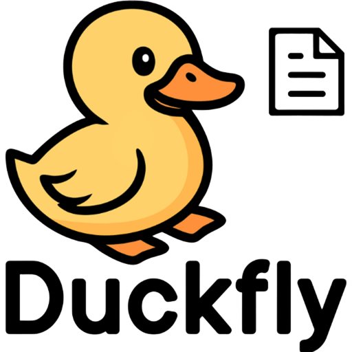

<p align="center">
  
</p>

<h1 align="center">Duckfly Proxy</h1>

<p align="center">
  Observe real API usage, continuously enrich documentation, and generate MCP servers with Duckfly.
</p>

<p align="center">
  <a href="https://www.npmjs.com/package/@duckfly/proxy"></a>
  <a href="https://opensource.org/licenses/MIT"></a>
</p>

## Overview

**Duckfly Proxy** is a lightweight HTTP proxy that observes real API usage and sends only **structural request metadata** to the Duckfly platform.

This allows your API documentation and MCP (Model Context Protocol) servers to be **continuously enriched** based on how your application actually behaves, keeping everything aligned as the system evolves.

## Why use Duckfly Proxy

- Continuously enriched API documentation
- MCP server generation for AI integrations
- Documentation aligned with real API usage

## Quick Start

### Global install

```bash
npm install -g @duckfly/proxy
```

### Or run directly with npx

```bash
npx @duckfly/proxy
```

After running, the CLI will ask for:

| Prompt | Description | Default |
|---|---|---|
| **Token** | Your Duckfly application token | — |
| **Proxy Port** | Port where the proxy listens | `8080` |
| **Target URL** | Your backend API address | `http://localhost:3000` |

Configuration is saved locally in `.duckfly-proxy.json` so you don't need to re-enter it every time.

## How It Works

```
┌─────────────┐        ┌──────────────┐        ┌──────────────┐
│ Application │ ───>   │ Duckfly Proxy│ ───>   │   Backend    │
└─────────────┘        └──────────────┘        └──────────────┘
                               │
              Sends API structure (with placeholders)
                               │
                               ▼
                       ┌─────────────────┐
                       │   Duckfly API   │
                       │ Documentation & │
                       │ MCP Generation  │
                       └─────────────────┘
```

1. Your application routes requests through Duckfly Proxy
2. The proxy forwards requests to your backend without changing behavior
3. Structural API information is sent to Duckfly
4. Documentation and MCP servers evolve continuously

## Data Handling

Duckfly Proxy processes only technical and structural information such as HTTP methods, routes, headers, and payload formats.

Request and response values are replaced with **placeholders** before being sent, ensuring no sensitive or user-specific data is transmitted.

## License

MIT License

This license applies only to the Duckfly Proxy package. The Duckfly platform and services are governed by separate terms.

<p align="center">Made with 🦆 by Duckfly</p>
